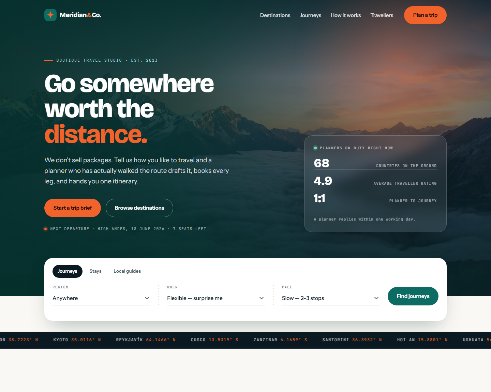
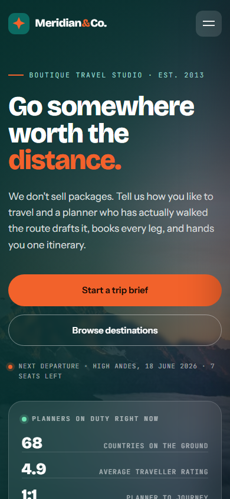

# Meridian & Co. — Travel Company Website

A single-page marketing site for a boutique travel studio, built with plain **HTML**, **CSS**
and **vanilla JavaScript**. No framework, no build step, no dependencies — open `index.html`
in a browser and it runs.



---

## Table of contents

- [Overview](#overview)
- [Getting started](#getting-started)
- [Project structure](#project-structure)
- [The hero](#the-hero)
- [Design system](#design-system)
- [Sections](#sections)
- [Interactions](#interactions)
- [Accessibility](#accessibility)
- [Responsive behaviour](#responsive-behaviour)
- [Images and fallbacks](#images-and-fallbacks)
- [Performance](#performance)
- [Deploying](#deploying)
- [Notes for production](#notes-for-production)

---

## Overview

Meridian & Co. is a fictional travel studio that drafts, books and hand-manages trips one
traveller at a time. The page sells that promise: an editorial hero, a boarding-pass search
panel, filterable destinations, three featured departures, a numbered process, animated
stats, testimonials and a trip-brief contact form.

Everything is hand-written and readable in one sitting:

| Concern | File |
| --- | --- |
| Markup and copy | `index.html` |
| Tokens, layout, components, breakpoints | `css/style.css` |
| Navigation, filtering, reveals, validation | `js/script.js` |

There is nothing to install and nothing to compile. The whole site is three files plus two
icons.

---

## Getting started

**Fastest** — double-click `index.html`.

**Recommended** — serve it over a local HTTP server so fonts, images and the service of
`fetch`-free assets behave exactly as they will in production:

```bash
# Python
python -m http.server 8000

# Node
npx serve .

# PHP
php -S localhost:8000
```

Then open <http://localhost:8000>.

**Requirements:** any modern browser. No Node, no package manager, no `npm install` —
`node_modules/` is listed in `.gitignore` for convenience, but this project has no
dependencies to install.

---

## Project structure

```
travel-website/
├── index.html            single-page markup and all copy
├── css/
│   └── style.css         design tokens, layout, components, breakpoints
├── js/
│   └── script.js         one IIFE: nav, filtering, reveals, counters, forms
├── docs/
│   ├── hero-desktop.png  README screenshots
│   └── hero-mobile.png
├── favicon.svg           site icon
├── apple-touch-icon.svg  iOS home-screen icon
├── .gitignore
└── README.md
```

---

## The hero

The hero was rebuilt from scratch as a layered, two-column composition.



**Backdrop** — four stacked layers inside `.hero-bg`, each with a job:

1. `.hero-photo` — full-bleed Unsplash image, `object-fit: cover`, slightly scaled to avoid
   edge artefacts.
2. `.hero-mesh` — a 28px dotted coordinate grid, masked so it fades out toward the copy.
3. `.hero-veil` — a two-stop directional gradient (dark behind the text, open toward the
   photo) plus a vertical gradient that sinks into the footer colour at the bottom.
4. `.hero-glow` — a soft orange radial in the top-right corner, echoing the brand's
   "signal orange" accent.

**Layout** — `.hero-grid` is a `1.25fr / 0.75fr` grid aligned to the bottom edge, so the
status panel sits on the same baseline as the call-to-action row:

- **Copy column** — eyebrow → three-line headline (`distance.` in orange) → lede → two
  buttons → a mono departure note with a pulsing dot.
- **Status panel** — a frosted glass card (`backdrop-filter: blur`) holding a "planners on
  duty" header, the studio stats (`68 / 4.9 / 1:1`) as hairline-divided rows, and a dashed
  footer rule that mirrors the perforation of the boarding pass below.

**Overlap** — `.hero` uses `display: flow-root` so the boarding-pass search panel can hang
`4.5rem` past the hero's bottom edge with its margin intact instead of collapsing away. The
ticker starts `6.5rem` after the hero, leaving a clean `2rem` band of background between the
card and the dark route ticker.

**Spacing** — every gap in the hero is a `clamp()`, so the rhythm scales between viewports
instead of snapping:

| Relationship | Value |
| --- | --- |
| Page top → eyebrow (clears the fixed header) | `clamp(7.5rem, 15vh, 10.5rem)` |
| Eyebrow → headline | `1.35rem` |
| Headline → lede | `1.5rem` |
| Lede → buttons | `2.25rem` |
| Buttons → departure note | `1.6rem` |
| Column gap | `clamp(2rem, 4.5vw, 4rem)` |
| Content → search panel | `clamp(3.25rem, 6vw, 4.75rem)` |
| Search panel → route ticker | `2rem` |

---

## Design system

Tokens are declared once at the top of `css/style.css`, so colour and type changes propagate
everywhere.

| Token | Value | Use |
| --- | --- | --- |
| `--ink` | `#0B1A22` | primary text, dark bands |
| `--ink-soft` | `#14262F` | quote text |
| `--lagoon` | `#0C6B62` | brand teal, primary buttons |
| `--lagoon-deep` | `#07453F` | deep teal accent |
| `--kelp` | `#05302C` | deep teal, footer and hero base |
| `--sun` | `#F2622B` | signal orange, accents and secondary buttons |
| `--sun-soft` | `#FBE3D7` | orange tint, coordinate pills |
| `--salt` | `#FAF8F4` | page background |
| `--paper` | `#FFFFFF` | card surfaces |
| `--stone` | `#E1DED4` | borders and rules |
| `--slate` | `#4C5F65` | secondary text |
| `--radius` / `--radius-lg` / `--radius-sm` | `18px` / `24px` / `10px` | corner radii |
| `--shell` | `1180px` | content measure |
| `--section-pad` | `clamp(4.5rem, 9vw, 8rem)` | vertical section rhythm |
| `--ease` | `cubic-bezier(0.22, 0.61, 0.36, 1)` | every transition |

**Type** — three families from Google Fonts:

- **Bricolage Grotesque** (800) — display headings and stat numerals.
- **Instrument Sans** (400/500/600) — body copy and UI.
- **JetBrains Mono** (400/500) — coordinates, labels, timestamps. The geographic
  coordinates that run through the design are the signature detail.

**Signature element** — the boarding-pass search panel that overlaps the hero. Its dotted
perforation dividers are a repeating radial gradient, so they cost no extra markup or images.

---

## Sections

| # | Section | What it does |
| --- | --- | --- |
| 1 | Header | Fixed; gains a frosted background after 40px of scroll |
| 2 | Hero | Layered backdrop, headline, status panel, boarding-pass search |
| 3 | Route ticker | Scrolling coordinates, pauses on hover |
| 4 | Destinations | Eight cards with region filtering |
| 5 | Journeys | Three featured departures, alternating image side |
| 6 | Process | A three-step numbered sequence |
| 7 | Stats | Counters that animate when scrolled into view |
| 8 | Travellers | Three testimonials with a coordinate pill |
| 9 | Trip brief | Contact form with inline validation |
| 10 | Footer | Navigation, contact and legal links |

---

## Interactions

`js/script.js` is a single IIFE with no globals. It handles:

- **Sticky header** — toggles `is-stuck` past 40px, throttled through `requestAnimationFrame`.
- **Mobile navigation** — a right-hand drawer that closes on link click, on `Escape`, and
  reports `aria-expanded` on the toggle button.
- **Scroll reveals** — `IntersectionObserver` adds `is-in` once per element, then unobserves
  it. Stagger is driven by an inline `--d` custom property.
- **Region filtering** — one `applyFilter()` function backs both the destination chips and
  the boarding-pass search, so the two never drift out of sync, and the result count is
  announced through an `aria-live` status line.
- **Animated counters** — stats count up on first intersection using an ease-out curve.
- **Trip brief validation** — per-field `is-error` states, focus moved to the first problem
  field, and a pluralised message in an `aria-live` region.

Navigation is smooth-scrolling via CSS `scroll-behavior`, with `scroll-margin-top` on every
`section[id]` so anchored headings clear the fixed header.

---

## Accessibility

- Skip link to the main content, visible only on focus.
- A visible `:focus-visible` ring (`3px` orange, offset) on every interactive element.
- `aria-expanded` on the menu button, `aria-selected` on the search tabs (`role="tablist"`).
- `role="status"` + `aria-live="polite"` on both forms.
- Decorative layers are `aria-hidden`; informative images carry real `alt` text.
- Form errors are identified by colour **and** text, never colour alone.
- Layout and motion both respect `prefers-reduced-motion`: reveals are shown immediately,
  the ticker stops scrolling and smooth scrolling is disabled.
- The hero panel is an `<aside>` with an accessible name, and its stats keep native
  `<dl>/<dt>/<dd>` semantics.

---

## Responsive behaviour

Breakpoints:

| Width | Change |
| --- | --- |
| `≤ 960px` | Hero collapses to a single column; the search panel's fields reflow to two columns |
| `≤ 820px` | Desktop nav becomes a drawer with a hamburger toggle |
| `≤ 640px` | Buttons go full width, tighter hero padding, one-column search fields and forms |

Layout moves from four columns to two to one, and the journey cards stack with the image
first.

Verified with **no horizontal overflow** at 1600, 1440, 1280, 1024, 960, 900, 820, 768, 640,
480, 390 and 360px (checked against `document.documentElement.scrollWidth`).

---

## Images and fallbacks

Photographs load from Unsplash. Every image has an `onerror` handler that swaps in a branded
teal gradient (`.is-fallback`), so a failed request degrades to a designed placeholder rather
than a broken-image icon. Copy is matched to what each photograph actually shows.

Images below the fold use `loading="lazy"`; the hero image uses `fetchpriority="high"`.

---

## Performance

- Three files, no bundler, no runtime dependencies.
- All animation runs on `transform` and `opacity` — no layout thrash.
- Scroll and intersection work is batched through `requestAnimationFrame` and observers
  rather than raw event handlers.
- Fonts are preconnected and loaded with `display=swap`.

---

## Deploying

Any static host works — there is no build step:

- **GitHub Pages** — push to `main`, then enable Pages for the repository root.
- **Netlify / Vercel / Cloudflare Pages** — point at the repository and leave the build
  command empty; publish directory is `/`.

---

## Notes for production

- The contact form is front-end only. Point it at a real endpoint, or a service such as
  Formspree, and move validation server-side as well.
- Google Fonts is loaded from CDN. Self-host the three families before launch to avoid the
  third-party request.
- Add Open Graph and Twitter card tags with a real share image before publishing.
- The copy, statistics, destinations and testimonials are fictional sample content.
